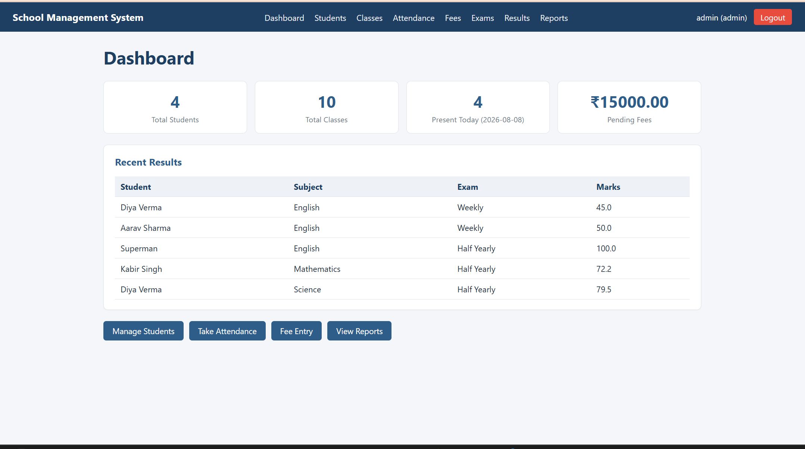
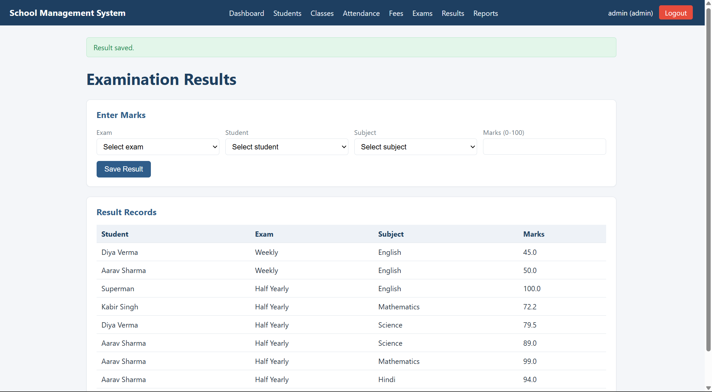

# School Management & Student Information System

## Screenshots




A working Flask + SQLite web application built for the NIELIT 'O' Level (IT)
project, matching the scope described in the project report: student
records, class/section management, attendance, fees, examinations/results,
a dashboard, and basic reports.

## How to run it on your own computer

1. **Install Python 3.10+** if you don't already have it (check with `python3 --version`).

2. **Open a terminal in this folder** (`school_management/`).

3. **Create and activate a virtual environment:**
   ```
   python3 -m venv venv
   # Windows:
   venv\Scripts\activate
   # macOS/Linux:
   source venv/bin/activate
   ```

4. **Install dependencies:**
   ```
   pip install -r requirements.txt
   ```

5. **Initialize the database** (creates `school.db` with tables and a default admin user):
   ```
   python database.py
   ```

6. **(Optional) Load sample/dummy data** for demonstration purposes:
   ```
   python seed_sample_data.py
   ```
   This adds a couple of fictitious students, classes, subjects and an exam
   — useful only for taking demo screenshots. You can skip this and enter
   your own data instead if you prefer.

7. **Run the application:**
   ```
   python app.py
   ```

8. **Open your browser** to `http://127.0.0.1:5050`

9. **Log in** with the default admin account:
   - Username: `admin`
   - Password: `admin123`

   Change this password (or create a new admin user directly in the
   database) before treating this as anything beyond an academic demo.

## Taking screenshots for your report

Once the app is running and you've entered some real or sample data:
1. Log in → screenshot the login page.
2. Go to Dashboard → screenshot the stat cards.
3. Go to Students → add a student → screenshot the form and the table.
4. Go to Attendance → pick a class and date → screenshot the roster.
5. Go to Fees → add a payment → screenshot the fee table.
6. Go to Exams/Results → create an exam, enter marks → screenshot results.
7. Go to Reports → screenshot the attendance/fee summaries.

Replace the placeholder Figures in Section 11 of the report with these,
and paste your actual `app.py`, `database.py`, `schema.sql`, and template
files into Appendix A in place of the sample excerpts.

## Project structure

```
school_management/
├── app.py              # Flask routes and application logic
├── database.py         # DB connection + one-time schema initialization
├── schema.sql           # Table definitions
├── seed_sample_data.py # Optional dummy data for screenshots
├── requirements.txt
├── templates/           # Jinja2 HTML templates
│   ├── base.html
│   ├── login.html
│   ├── dashboard.html
│   ├── students.html
│   ├── classes.html
│   ├── attendance.html
│   ├── fees.html
│   ├── exams.html
│   ├── subjects.html
│   ├── results.html
│   └── reports.html
└── static/
    ├── css/style.css
    └── js/app.js
```

## Notes on authenticity for NIELIT submission

- This code was built specifically for your project and tested end-to-end
  (login, adding students, marking attendance, recording fees, entering
  results with validation, viewing reports) — all against a real SQLite
  database, not mocked.
- You should still run it yourself, explore it, understand how it works,
  and be ready to explain it and modify it live if your guide asks — that's
  the actual point of the exercise, not just having files that run.
- Replace the default secret key and admin password before calling this
  "secure"; as noted in the report, this is an academic prototype, not a
  production deployment.
- Use only dummy/fictitious student data (as already done in
  `seed_sample_data.py`) unless you have explicit authorization to use real
  student records.
